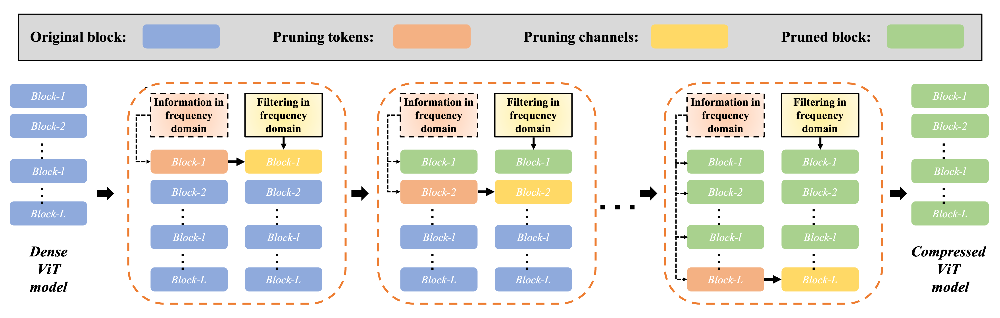
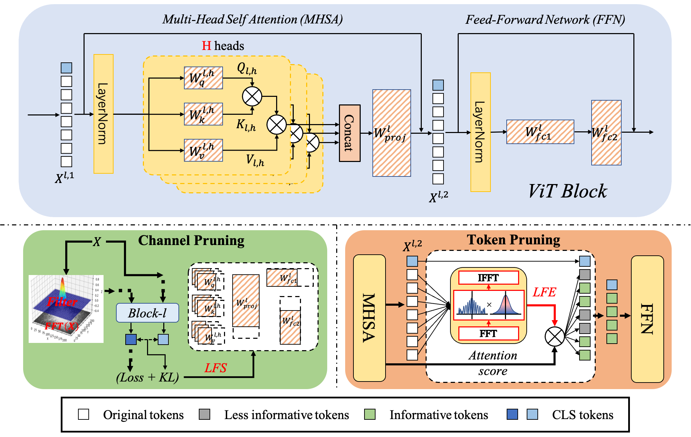

# [NeurIPS 2022] VTC-LFC: Vision Transformer Compression with Low-Frequency Components

This repository contains PyTorch evaluation code, training code and pretrained models for the following projects:
* VTC-LFC (Vision Transformer Compression with Low-Frequency Components), NeurIPS 2022

For details see [VTC-LFC: Vision Transformer Compression with Low-Frequency Components](https://openreview.net/forum?id=HuiLIB6EaOk) by Zhenyu Wang, Hao Luo, Pichao Wa, Feng Ding, Fan Wan, and Hao Li. 

## Pipeline





# Model Zoo

We provide compressed DeiT models fine-tuned on ImageNet 2012.

| name | acc@1 | acc@5 | #FLOPs | #params | url |
| --- | --- | --- | --- | --- | --- |
| DeiT-tiny | 71.6 | 90.7 | 0.7G | 5.1M | [model](https://drive.google.com/file/d/1NSq3SRxnObfl6oaFE5gHtjnhzm0Lfc6S/view?usp=sharing) |
| DeiT-small | 79.4 | 94.6 | 2.1G | 17.7M | [model](https://drive.google.com/file/d/1pi8IOo35qcTuHl1yL4lOTqD0qj5LFsp-/view?usp=sharing) |
| DeiT-base | 81.3 | 95.3 | 7.5G | 63.5M | [model](https://drive.google.com/file/d/1JvFJ6IQo1vxI1sMeURtkxEINy1tmKDNa/view?usp=sharing) |

# Usage

First, clone the repository locally:
```
git clone
```
Then, install requirements:
```
pip install -r -requriments.txt
(we use /torch 1.7.1 /torchvision 0.8.2 /timm 0.3.4/ fvcore 0.1.5 /cuda 11.0 / 16G or 32G V100 for training and evaluation.
Note that we use torch.cuda.amp to accelerate speed of training which requires pytorch >=1.6)
```
## Data preparation

Download and extract ImageNet train and val images from http://image-net.org/.
The directory structure is the standard layout for the torchvision [`datasets.ImageFolder`](https://pytorch.org/docs/stable/torchvision/datasets.html#imagefolder), and the training and validation data is expected to be in the `train/` folder and `val` folder respectively:

```
/path/to/imagenet/
  train/
    class1/
      img1.jpeg
    class2/
      img2.jpeg
  val/
    class1/
      img3.jpeg
    class/2
      img4.jpeg
```

## Pretrained models

You can download the official pretrained models from here.

| name | acc@1 | acc@5 | #params | url |
| --- | --- | --- | --- | --- |
| DeiT-tiny | 72.2 | 91.1 | 5M | [model](https://dl.fbaipublicfiles.com/deit/deit_tiny_patch16_224-a1311bcf.pth) |
| DeiT-small | 79.9 | 95.0 | 22M| [model](https://dl.fbaipublicfiles.com/deit/deit_small_patch16_224-cd65a155.pth) |
| DeiT-base | 81.8 | 95.6 | 86M | [model](https://dl.fbaipublicfiles.com/deit/deit_base_patch16_224-b5f2ef4d.pth) |

## Pruning
To pruning a pre-trained DeiT model on ImageNet:
```
python -m torch.distributed.launch --master_port 29500 --nproc_per_node=2 --use_env ./pruning/pruning_py/pruning_deit.py \
--device cuda \
--data-set IMNET \
--batch-size 128 \
--num-classes 1000 \
--dist-eval \
--model deit_tiny_cfged_patch16_224 \
--data-path /path/to/imagenet \
--resume /path/to/pretrained model \
--prune-part qkv,fc1 \
--prune-criterion lfs \
--prune-block-id 0,1,2,3,4,5,6,7,8,9,10,11 \
--cutoff-channel 0.1 \
--cutoff-token 0.85 \
--lfs-lambda 0.1 \
--num-samples 2000 \
--keep-qk-scale \
--prune-mode bcp \
--allowable-drop 9.5 \
--drop-for-token 0.56 \
--prune --prune-only \
--output-dir /path/to/save
```

## Fine-tuning
To fine-tuning a pruned DeiT model on ImageNet:
```
python -m torch.distributed.launch --master_port 29500 --nproc_per_node=8 --use_env ./pruning/pruning_py/pruning_deit.py \
--device cuda \
--epochs 300 \
--lr 0.0001 \
--data-set IMNET \
--num-classes 1000 \
--dist-eval \
--model deit_tiny_cfged_patch16_224 \
--batch-size 512 \
--teacher-model deit_tiny_cfged_patch16_224 \
--distillation-alpha 0.1 \
--distillation-type hard \
--warmup-epochs 0 \
--keep-qk-scale \
--finetune-only \
--output-dir /path/to/save \
--data-path /path/to/imagenet \
--teacher-path /path/to/original model  \
--resume /path/to/pruned model
```

## Citation

If you use this code for a paper please cite:

```
@inproceedings{
wang2022vtclfc,
title={{VTC}-{LFC}: Vision Transformer Compression with Low-Frequency Components},
author={Zhenyu Wang and Hao Luo and Pichao WANG and Feng Ding and Fan Wang and Hao Li},
booktitle={Thirty-Sixth Conference on Neural Information Processing Systems},
year={2022},
url={https://openreview.net/forum?id=HuiLIB6EaOk}
}
```

# License
This repository is released under the Apache 2.0 license as found in the [LICENSE](LICENSE) file.

# Contributing
We actively welcome your pull requests!
